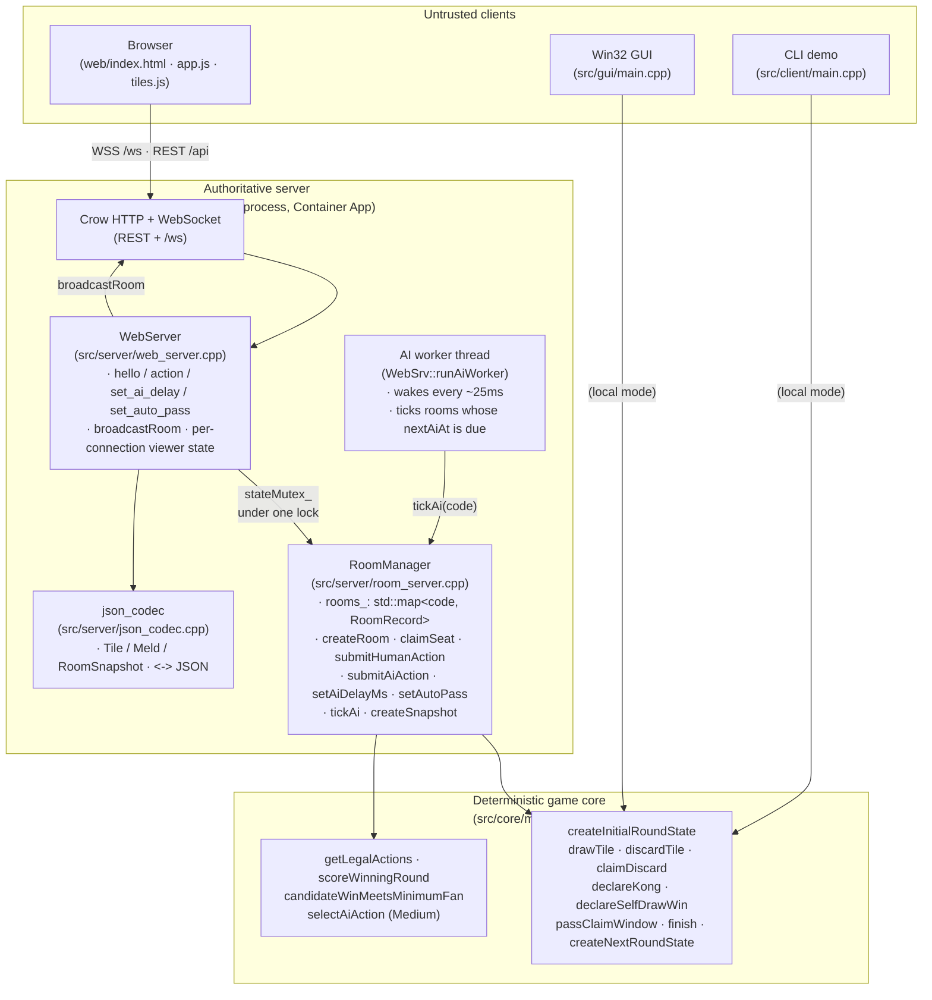
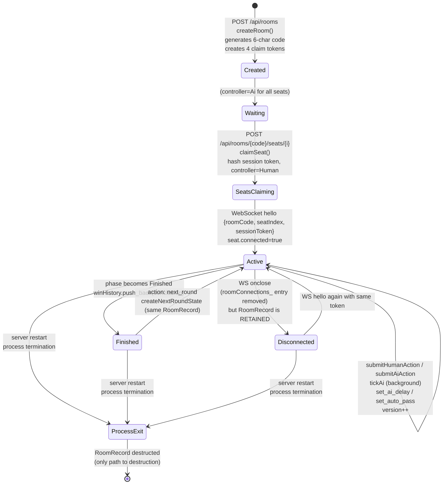
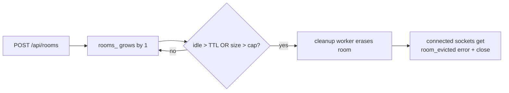
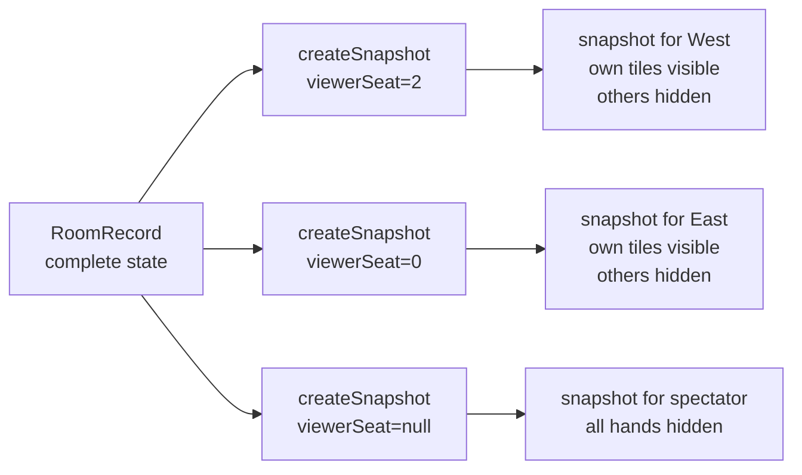

# Rooms, capacity & architecture

This document explains four things:

1. **Code architecture** — how the C++ web server is organized and what each
   component does.
2. **Room lifecycle** — when a `RoomRecord` is created, when it's mutated, and
   when (if ever) it's destroyed.
3. **Concurrent room capacity** — the math behind how many rooms a single
   server instance can host.
4. **4-player interaction** — a sequence diagram of a typical hand of play
   between four seats (a mix of humans and AIs).

> All diagrams use [Mermaid](https://mermaid.js.org/) and render natively on
> GitHub, Azure DevOps, and most Markdown viewers.

---

## 1. Code architecture

The system splits into three trust tiers: a deterministic game core, an
authoritative room layer, and untrusted clients. The web server is the only
thing that holds hidden state.



**Trust boundary.** Clients never see hidden state (other players' tiles, the
remaining wall). They submit actions with an `expectedVersion`. The server
re-runs `getLegalActions(state, seat)` on every submission and rejects
anything that wouldn't be legal at the current version. This matches the
trust model used by Mahjong Soul and similar online games.

**Threading.** A single `std::mutex stateMutex_` guards both `rooms_` and the
per-connection bookkeeping. The AI worker thread holds it while ticking due
rooms; the WS event loop holds it while processing inbound messages. A
`condition_variable aiWorkerCv_` lets human actions wake the worker early.

---

## 2. Room lifecycle

A `RoomRecord` lives entirely in memory inside `RoomManager::rooms_`. Its
lifecycle is brutally simple — it's created on demand and destroyed only when
the process exits.



### Lifecycle event reference

| Event | What changes | Code path |
| --- | --- | --- |
| **Create** | New `RoomRecord` inserted into `rooms_`. Wall shuffled with seed = supplied seed or room code. 4 random claim tokens generated; hashes stored on seats. All seats `controller=Ai`. | `RoomManager::createRoom` (`room_server.cpp:81`) |
| **Claim seat** | Seat `controller=Human`, `displayName` set, `sessionTokenHash` stored. `room.version++`. AI cascade re-runs if `aiDelayMs == 0`. | `RoomManager::claimSeat` (`room_server.cpp:122`) |
| **Connect** | `connections_[conn] = {roomCode, seatIndex}`; conn added to `roomConnections_[code]`. Initial snapshot pushed. | `WebServer::onMessage` "hello" (`web_server.cpp:240+`) |
| **Submit action** | Validates `expectedVersion`. Replays via `applyLegalAction`. `roundState`, `pendingClaimPasses`, `winHistory` (if finishing), `version` all updated. Broadcasts a fresh snapshot to everyone in the room. | `RoomManager::submitSeatAction` (`room_server.cpp:192`) |
| **AI tick** | Worker wakes, holds `stateMutex_`, calls `tickAi(code)` for each room whose `nextAiAt <= now`. Runs at most one AI action per tick → broadcasts. | `WebServer::runAiWorker` (`web_server.cpp:68+`), `RoomManager::tickAi` |
| **Set autoPass / aiDelay** | Mutates one field on `RoomRecord`, bumps `version`, broadcasts. Applies room-wide. | `RoomManager::setAutoPass` / `setAiDelayMs` |
| **Disconnect** | Conn removed from `connections_` + `roomConnections_`. **`RoomRecord` is NOT touched.** Reconnecting with the same `sessionToken` resumes the seat. | `WebServer::onClose` (`web_server.cpp:211`) |
| **Idle eviction** | Background cleanup worker wakes every `MAHJONG_CLEANUP_INTERVAL_SECONDS` (default 60s). Rooms idle past their phase-specific TTL are removed; any still-attached WS connections receive `{type:"error",code:"room_evicted"}` and are closed. | `WebServer::runCleanupWorker` |
| **Size-cap eviction** | If `rooms_.size() > MAHJONG_MAX_ROOMS` (default 5000), the cleanup pass also drops the oldest-idle rooms until back under the cap. Finished rooms break ties first. | `RoomManager::evictIdleRooms` |
| **Destroy** | Idle TTL, size-cap eviction, or process exit. | `RoomManager::evictIdleRooms` |

### Room TTL configuration

| Env var | Default | Meaning |
|---|---|---|
| `MAHJONG_ROOM_TTL_FINISHED_SECONDS` | `1800` (30 min) | Idle TTL for rooms in `Phase::Finished`. |
| `MAHJONG_ROOM_TTL_ACTIVE_SECONDS`   | `21600` (6 h)   | Idle TTL for rooms in any other phase (draw / discard / claims). |
| `MAHJONG_CLEANUP_INTERVAL_SECONDS`  | `60`            | How often the cleanup worker scans `rooms_`. |
| `MAHJONG_MAX_ROOMS`                 | `5000`          | Hard upper bound on `rooms_.size()`. Set to `0` to disable the cap. |

"Idle" means *no activity since `lastActivityAt`* — and activity includes
seat claim, any submitted action, AI ticks that produced a move, any
`set_auto_pass`/`set_ai_delay` change, **and any incoming WebSocket message
bound to the room** (so just keeping a tab open with a live socket
heartbeat keeps the room alive).

### ⚠️ Trade-offs



- Players who genuinely abandon a room recover its memory automatically.
- A bot hammering `POST /api/rooms` can still create rooms up to `MAHJONG_MAX_ROOMS`
  before the cap kicks in. For real adversarial protection add HTTP rate
  limiting at the Container Apps ingress.
- An active room (not Finished) survives 6 h of inactivity by default, so
  drop-and-reconnect tomorrow morning is still safe within that window.
- A finished round survives 30 min by default, then is reaped. Players who
  want to keep reviewing the history should keep the tab open.

---

## 3. Concurrent room capacity

Three things bound how many rooms a single server instance can host:

### 3.1 Room-code namespace

```
alphabet = "ABCDEFGHJKLMNPQRSTUVWXYZ23456789"   // 31 chars (Crockford-ish)
code     = 6 characters
unique codes = 31^6 ≈ 887,503,681  (~887 million)
```

The `createRoom` retry loop (`while (rooms_.contains(code)) code = createRoomCode()`)
stays cheap until the room count approaches millions, by the birthday-paradox
math. Below ~10K active rooms the probability of a collision on any single
attempt is `< 10⁻⁵`.

### 3.2 Per-room memory

| Field | Approx. size | Notes |
| --- | --- | --- |
| `RoundState.wall` | ~10 KB | 144 tiles × ~64 B each |
| 4 × `Player` (hand, melds, discards) | ~6 KB | grows over a hand |
| 4 × `RoomSeatRecord` | ~1 KB | display name + token hashes |
| `winHistory` | ~0.5 KB per finished round | unbounded for the room's life |
| Crow WS frame buffers | varies, allocated per connection | not per room |

**Conservative estimate: ~30 KB per fresh room, growing to ~100 KB over a
long multi-round match.**

### 3.3 OS-level fd budget

Each connected client = one WebSocket = one fd. Container Apps replicas
typically inherit a 65,535 soft limit. With 4 clients per room, that's an
upper bound of ~16,000 simultaneously-connected rooms before fds become the
binding constraint. In practice you'd hit memory or CPU first.

### 3.4 Practical guidance

| Replica spec | Memory budget for `rooms_` | Steady-state active rooms (4-player) |
| --- | --- | --- |
| 0.25 vCPU / 0.5 GiB | ~300 MiB usable | **~3,000–8,000** rooms |
| 0.5 vCPU / 1 GiB | ~700 MiB usable | **~7,000–20,000** rooms |
| 1 vCPU / 2 GiB | ~1.5 GiB usable | **~15,000–45,000** rooms |

These numbers assume no malicious client churn and no per-room CPU bursts.
The AI worker is single-threaded and holds `stateMutex_` per tick, so wall-
clock AI throughput becomes the bottleneck well before memory does at the
high end of these ranges. Horizontal scale is **NOT** supported today (state
lives only in process memory), so to scale beyond one replica you'd need to
introduce a sticky session key or move state to Redis/Cosmos.

---

## 4. Four-player interaction — one full hand

Below is a typical hand: East (human), South (AI), West (human), North (AI),
all in one room. AI delay is set to 600 ms so each AI action shows up as a
separate snapshot.

```mermaid
sequenceDiagram
  autonumber
  actor East as East player (browser)
  actor West as West player (browser)
  participant WS as WebServer + Crow
  participant Mgr as RoomManager
  participant AI as AI worker thread
  participant Engine as Core engine

  Note over East,West: Out-of-band: host did POST /api/rooms and shared the<br/>4 claim links. Both humans POST /api/rooms/{code}/seats/{i}<br/>then open WS and send "hello".

  East->>WS: hello {room, seat=0, token}
  WS->>Mgr: getRoom + authorize seat
  WS-->>East: snapshot v=N (legalActions=[draw])
  West->>WS: hello {room, seat=2, token}
  WS-->>West: snapshot v=N (no legalActions; not their turn)

  East->>WS: action {expectedVersion=N, draw}
  WS->>Mgr: submitHumanAction(seat=0, draw)
  Mgr->>Engine: drawTile(state, 0)
  Engine-->>Mgr: state' (East has 14 tiles)
  Mgr->>Mgr: version++; aiDelayMs>0 → refreshAiPending
  WS-->>East: snapshot v=N+1 (legalActions=[discard×13, win?])
  WS-->>West: snapshot v=N+1 (East drew; concealedTiles hidden)

  East->>WS: action {expectedVersion=N+1, discard tile-X}
  WS->>Mgr: submitHumanAction(0, discard)
  Mgr->>Engine: discardTile(state, X)
  Engine-->>Mgr: state' (phase=AwaitingClaims; lastDiscard={tile=X, bySeat=0})
  Mgr-->>WS: ok, version=N+2
  WS-->>East: snapshot v=N+2 (legalActions=[])
  WS-->>West: snapshot v=N+2 (legalActions includes pass + maybe chow/pong/kong/win)

  Note over WS,AI: AI seats South (1) and North (3) also have a pass-only<br/>window. WebServer leaves it to the AI worker.

  AI->>Mgr: tickAi(code)  // wakes when nextAiAt is due
  Mgr->>Engine: selectAiAction(state, seat=1, [pass])
  Engine-->>Mgr: pass
  Mgr->>Mgr: submitAiAction(1, pass) → pendingClaimPasses=[1]<br/>version=N+3
  WS-->>East: snapshot v=N+3
  WS-->>West: snapshot v=N+3

  alt West clicks Pass (autoPass=on, no claim options for West)
    West->>WS: action {expectedVersion=N+3, pass}
    WS->>Mgr: submitHumanAction(2, pass)
    Note right of Mgr: pendingClaimPasses=[1,2,3 (after AI North)]<br/>== all non-discarders → passClaimWindow → next seat's turn
  else West calls Chow
    West->>WS: action {expectedVersion=N+3, chow, tiles=[a,b]}
    WS->>Mgr: submitHumanAction(2, chow)
    Mgr->>Engine: claimDiscard(state, 2, chow)
    Engine-->>Mgr: state' (West has meld, discards tile-Y, phase=AwaitingClaims again)
    WS-->>East: snapshot v=N+4 (legalActions include pass / win?)
    WS-->>West: snapshot v=N+4 (legalActions=[discard×13])
  end

  Note over East,West: Many turns later — East self-draws a winning tile.

  East->>WS: action {expectedVersion=K, win, source=selfDraw}
  WS->>Mgr: submitHumanAction(0, win)
  Mgr->>Engine: declareSelfDrawWin(state)
  Engine->>Engine: scoreWinningRound(state, conclusion)
  Engine-->>Mgr: state' (phase=Finished, conclusion={reason=win,<br/>winnerSeat=0, source=selfDraw, winningTile=T, settlement=…})
  Mgr->>Mgr: winHistory.push_back(conclusion); version++
  WS-->>East: snapshot (conclusion + winHistory[N+1])
  WS-->>West: snapshot (same)

  East->>WS: action {next_round}
  WS->>Mgr: submitHumanAction(0, next_round)
  Mgr->>Engine: createNextRoundState(state)
  Engine-->>Mgr: state'' (fresh wall, rotated dealer)
  Note right of Mgr: winHistory PERSISTS across next_round.<br/>conclusion field on the new state is empty.
  WS-->>East: snapshot v++ (new round started)
  WS-->>West: snapshot v++
```

### Snapshot scoping (privacy rule)

Each broadcast goes through `RoomManager::createSnapshot(room, viewerSeat)`.
The viewer's own concealed tiles are filled in; every other seat's
`concealedTiles` is `nullopt` (only `concealedCount` is exposed). The wall,
opponent draws, and pending replacement tiles never appear in the JSON.



---

## 5. Quick reference

| Question | Answer | Source |
| --- | --- | --- |
| Where are rooms stored? | `RoomManager::rooms_` (`std::map<std::string, RoomRecord>`) in process memory. | `room_server.hpp:124` |
| How many concurrent rooms? | ~3K–8K on 0.5 GiB, ~15K–45K on 2 GiB; capped by memory, not by code-space. | §3 |
| When is a room destroyed? | Cleanup worker evicts on idle TTL (30 min finished / 6 h active by default) or when over `MAHJONG_MAX_ROOMS`. Also on process exit. | `RoomManager::evictIdleRooms` |
| Are settings (autoPass, aiDelay) per-client or per-room? | **Per-room.** Both live on `RoomRecord`, are bumped via dedicated WS messages, and broadcast in every snapshot. | `room_server.hpp:33-43` |
| Where does the win log live? | `RoomRecord::winHistory` — append-only, captured on `!=Finished → Finished` transition, persists across `next_round`. | `room_server.cpp:212-220` |
| How do clients trust the server? | They don't see hidden state; every action carries `expectedVersion`; server re-validates legality. | `submitSeatAction` |
| How is the AI scheduled? | A dedicated worker thread waits on `aiWorkerCv_`; for each room with `aiPending` it runs one action per tick, then broadcasts. | `web_server.cpp:68-115` |

For future work on horizontal scale (multi-replica with shared store), see
the project plan.
